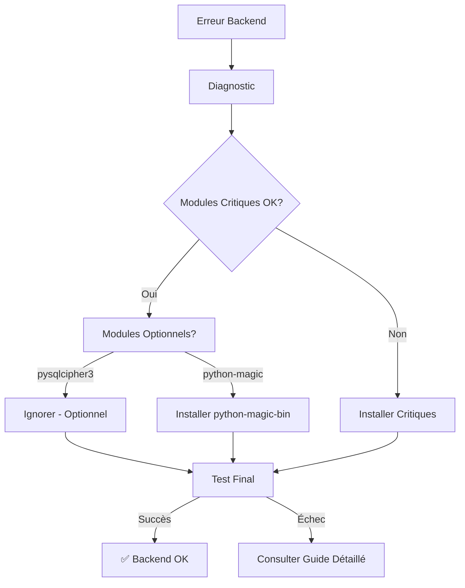

# Solutions pour Windows - Erreur "Probleme configuration backend"

## 🚨 Problème Identifié

L'erreur `"ERROR: Probleme configuration backend"` lors du test `python -c "import app; print('Backend OK')"` est généralement causée par:

1. **Modules Python manquants** dans l'environnement virtuel
2. **Incompatibilités Windows** avec certaines dépendances (pysqlcipher3, python-magic)
3. **Problèmes de compilation** de modules natifs sur Windows

## ✅ Solutions Rapides

### 🔧 Solution 1: Script Automatique (Recommandé)

**Batch (CMD):**
```bash
fix_windows_dependencies.bat
```

**PowerShell:**
```powershell
.\Fix-WindowsDependencies.ps1
```

### 🔧 Solution 2: Correction Manuelle

```bash
# 1. Activer l'environnement virtuel
venv\Scripts\activate

# 2. Mettre à jour pip
python -m pip install --upgrade pip

# 3. Installer dépendances Windows-friendly
pip install -r requirements_windows.txt

# 4. Tester
python -c "import app; print('Backend OK')"
```

### 🔧 Solution 3: Dépendances Minimales

Si les solutions précédentes échouent:
```bash
pip install -r requirements_minimal.txt
python diagnostic_windows.py
```

## 🔍 Diagnostic Avancé

### Exécuter le Diagnostic Complet
```bash
python diagnostic_windows.py
```

Ce script identifie:
- ✅ Modules critiques présents/manquants
- ⚠️ Modules optionnels problématiques
- 🔧 Solutions spécifiques à votre environnement

### Sortie Attendue (Succès)
```
=== RÉSUMÉ DIAGNOSTIC ===
✅ TOUS LES MODULES CRITIQUES SONT PRÉSENTS
⚠️  MODULES OPTIONNELS MANQUANTS: pysqlcipher3
   Ces modules sont optionnels mais recommandés pour certaines fonctionnalités.
```

## 🎯 Modules Spécifiques Windows

### pysqlcipher3 (Optionnel)
- **Problème**: Difficile à compiler sur Windows
- **Impact**: Aucun - l'app utilise SQLite standard
- **Solution**: Ignorer - pas critique

### python-magic
- **Problème**: Nécessite libmagic.dll sur Windows
- **Solution**: `pip install python-magic-bin`

### cryptography
- **Problème**: Peut nécessiter Visual C++ Build Tools
- **Solution**: Installer "Microsoft C++ Build Tools" ou utiliser conda

## 📂 Fichiers de Solutions

| Fichier | Description |
|---------|-------------|
| `diagnostic_windows.py` | Script de diagnostic complet |
| `fix_windows_dependencies.bat` | Correction automatique (Batch) |
| `Fix-WindowsDependencies.ps1` | Correction automatique (PowerShell) |
| `requirements_windows.txt` | Dépendances Windows-friendly |
| `requirements_minimal.txt` | Dépendances minimales |
| `GUIDE_DEPANNAGE_WINDOWS.md` | Guide détaillé |

## 🔄 Processus de Résolution



## ⚠️ Notes Importantes

1. **SQLCipher**: L'erreur `pysqlcipher3 manquant` est normale sur Windows. L'app fonctionne avec SQLite standard.

2. **Messages d'avertissement**: Ces messages lors du test sont normaux:
   ```
   🚨 SÉCURITÉ: Génération d'une nouvelle clé JWT
   🚨 SÉCURITÉ: Génération d'une nouvelle clé de chiffrement
   ERROR:database_encrypted:SQLCipher non disponible (pysqlcipher3 manquant): No module named 'pysqlcipher3'. Fallback SQLite.
   ```

3. **Environnement virtuel**: Toujours s'assurer que `(venv)` est visible dans le prompt.

## 🚀 Après Correction

Une fois le backend configuré correctement:

```bash
# Démarrage normal
python -m uvicorn app:app --host 127.0.0.1 --port 8000 --reload

# Ou utiliser le script existant du projet
```

## 📋 Checklist Finale

- [ ] Environnement virtuel activé
- [ ] Python 3.8+ installé  
- [ ] Dépendances installées (requirements_windows.txt ou minimal)
- [ ] Test `python -c "import app; print('Backend OK')"` réussi
- [ ] Backend démarre avec uvicorn

## 🆘 Support Supplémentaire

Si les problèmes persistent:
1. Consultez `GUIDE_DEPANNAGE_WINDOWS.md`
2. Vérifiez les logs détaillés dans la console
3. Considérez utiliser Anaconda/Miniconda pour un environnement plus stable sur Windows