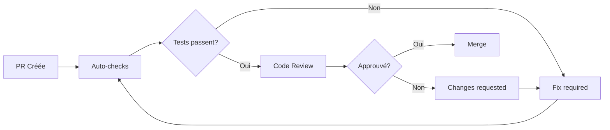

# Guide des Standards Techniques et Bonnes Pratiques
## Projet Budget Famille v2.3

---

## 1. Standards de Code et Conventions

### 1.1 Backend Python/FastAPI

#### Conventions de nommage
- **Classes**: PascalCase (`ConfigOut`, `Transaction`)
- **Fonctions/Méthodes**: snake_case (`get_config`, `ensure_default_config`)
- **Variables**: snake_case (`loan_amount`, `member1`)
- **Constantes**: UPPER_SNAKE_CASE (`EXPECTED_COLS`, `DATABASE_URL`)
- **Fichiers**: snake_case (`app.py`, `test_api.py`)

#### Structure de code
```python
# Ordre des imports
import os  # 1. Standard library
import json

import pandas as pd  # 2. Third-party packages
from fastapi import FastAPI

from models import Transaction  # 3. Local imports
from utils import calculate_split

# Constantes
DEFAULT_TIMEOUT = 30
MAX_RETRIES = 3

# Classes et fonctions
class BudgetService:
    """Service de gestion du budget familial."""
    
    def calculate_monthly_total(self, month: str) -> float:
        """
        Calcule le total mensuel des dépenses.
        
        Args:
            month: Mois au format YYYY-MM
            
        Returns:
            Total des dépenses du mois
        """
        pass
```

#### Checklist qualité Backend
- [ ] Docstrings pour toutes les fonctions publiques
- [ ] Type hints pour tous les paramètres et retours
- [ ] Validation des entrées avec Pydantic
- [ ] Gestion des erreurs avec HTTPException
- [ ] Logging des opérations critiques
- [ ] Pas de print() en production
- [ ] Transactions SQL dans des try/finally
- [ ] Constantes extraites en haut du fichier

### 1.2 Frontend TypeScript/Next.js

#### Conventions de nommage
- **Composants**: PascalCase (`MonthPicker`, `TransactionList`)
- **Fonctions**: camelCase (`loadTransactions`, `handleSubmit`)
- **Variables**: camelCase (`isLoading`, `selectedMonth`)
- **Constantes**: UPPER_SNAKE_CASE (`API_BASE_URL`, `MAX_FILE_SIZE`)
- **Types/Interfaces**: PascalCase avec préfixe I ou suffix Type (`ITransaction`, `ConfigType`)
- **Fichiers composants**: PascalCase (`MonthPicker.tsx`)
- **Autres fichiers**: camelCase (`api.ts`, `utils.ts`)

#### Structure de code TypeScript
```typescript
// Types et interfaces
interface ITransaction {
  id: number;
  month: string;
  amount: number;
  label: string;
  exclude: boolean;
  tags: string[];
}

// Composant React
export const TransactionList: React.FC<ITransactionListProps> = ({ 
  transactions,
  onUpdate 
}) => {
  // 1. Hooks d'abord
  const [loading, setLoading] = useState(false);
  const { month } = useGlobalMonth();
  
  // 2. Calculs dérivés
  const totalAmount = useMemo(
    () => transactions.reduce((sum, t) => sum + t.amount, 0),
    [transactions]
  );
  
  // 3. Handlers
  const handleUpdate = useCallback(async (id: number) => {
    // Implementation
  }, [onUpdate]);
  
  // 4. Effects
  useEffect(() => {
    // Side effects
  }, [month]);
  
  // 5. Render
  return (
    <div className="transaction-list">
      {/* JSX */}
    </div>
  );
};
```

#### Checklist qualité Frontend
- [ ] Types explicites pour props et state
- [ ] Validation des props avec TypeScript
- [ ] Gestion des états de chargement et erreur
- [ ] Memoization pour optimiser les performances
- [ ] Cleanup dans useEffect si nécessaire
- [ ] Accessibilité (ARIA labels, keyboard navigation)
- [ ] Responsive design (mobile-first)
- [ ] Pas de console.log en production

### 1.3 Standards communs

#### Git Commit Messages
```
type(scope): description courte

Description détaillée si nécessaire

Fixes #123
```

Types:
- `feat`: Nouvelle fonctionnalité
- `fix`: Correction de bug
- `docs`: Documentation
- `style`: Formatage, pas de changement de code
- `refactor`: Refactoring sans changement fonctionnel
- `test`: Ajout ou modification de tests
- `chore`: Maintenance, configuration

Exemples:
```
feat(transactions): ajouter filtrage par tags
fix(api): corriger calcul des totaux mensuels
docs(readme): ajouter instructions de déploiement
```

---

## 2. Stratégie de Tests

### 2.1 Tests Unitaires

#### Backend (pytest)
```python
# tests/test_calculations.py
import pytest
from app import get_split, split_amount

class TestCalculations:
    def test_split_by_revenue(self):
        """Test répartition basée sur les revenus."""
        result = get_split(rev1=3000, rev2=2000, mode="revenus")
        assert result == (0.6, 0.4)
    
    def test_split_manual(self):
        """Test répartition manuelle."""
        result = get_split(split1=0.7, split2=0.3, mode="manuel")
        assert result == (0.7, 0.3)
    
    @pytest.mark.parametrize("amount,expected", [
        (100, (50, 50)),
        (200, (100, 100)),
    ])
    def test_split_fifty_fifty(self, amount, expected):
        """Test répartition 50/50."""
        result = split_amount(amount, "50/50", 0.6, 0.4, 0.5, 0.5)
        assert result == expected
```

#### Frontend (Jest + React Testing Library)
```typescript
// __tests__/TransactionList.test.tsx
import { render, screen, fireEvent, waitFor } from '@testing-library/react';
import { TransactionList } from '../components/TransactionList';

describe('TransactionList', () => {
  const mockTransactions = [
    { id: 1, label: 'Courses', amount: -50, exclude: false },
    { id: 2, label: 'Salaire', amount: 3000, exclude: true }
  ];
  
  it('should display all transactions', () => {
    render(<TransactionList transactions={mockTransactions} />);
    expect(screen.getByText('Courses')).toBeInTheDocument();
    expect(screen.getByText('Salaire')).toBeInTheDocument();
  });
  
  it('should toggle exclude status', async () => {
    const onUpdate = jest.fn();
    render(
      <TransactionList 
        transactions={mockTransactions} 
        onUpdate={onUpdate}
      />
    );
    
    const toggleButton = screen.getByTestId('toggle-1');
    fireEvent.click(toggleButton);
    
    await waitFor(() => {
      expect(onUpdate).toHaveBeenCalledWith(1, { exclude: true });
    });
  });
});
```

### 2.2 Tests d'Intégration

#### Backend API Tests
```python
# tests/test_api_integration.py
from fastapi.testclient import TestClient
from app import app

client = TestClient(app)

def test_import_and_summary_flow():
    """Test flux complet: import -> calcul résumé."""
    # 1. Configuration initiale
    response = client.post("/config", json={
        "member1": "Alice",
        "member2": "Bob",
        "rev1": 3000,
        "rev2": 2000,
        "split_mode": "revenus"
    })
    assert response.status_code == 200
    
    # 2. Import de transactions
    with open("tests/fixtures/sample.csv", "rb") as f:
        response = client.post("/import", files={"file": f})
    assert response.status_code == 200
    transactions = response.json()
    assert len(transactions) > 0
    
    # 3. Récupération du résumé
    response = client.get("/summary?month=2024-01")
    assert response.status_code == 200
    summary = response.json()
    assert summary["member1"] == "Alice"
    assert "total_p1" in summary
```

### 2.3 Tests End-to-End (E2E)

#### Playwright Tests
```typescript
// e2e/budget-flow.spec.ts
import { test, expect } from '@playwright/test';

test.describe('Budget Management Flow', () => {
  test('complete budget workflow', async ({ page }) => {
    // 1. Navigation vers l'application
    await page.goto('http://localhost:3000');
    
    // 2. Configuration
    await page.click('text=Paramètres');
    await page.fill('input[name="member1"]', 'Alice');
    await page.fill('input[name="member2"]', 'Bob');
    await page.fill('input[name="rev1"]', '3000');
    await page.fill('input[name="rev2"]', '2000');
    await page.click('button:has-text("Enregistrer")');
    
    // 3. Import de fichier
    await page.click('text=Import');
    await page.setInputFiles('input[type="file"]', 'test-data/transactions.csv');
    await page.click('button:has-text("Importer")');
    
    // 4. Vérification du tableau de bord
    await page.click('text=Tableau de bord');
    await expect(page.locator('text=Part Alice')).toBeVisible();
    await expect(page.locator('.metric').first()).toContainText('€');
  });
});
```

### 2.4 Couverture de tests cible

| Type de test | Couverture minimale | Couverture cible |
|-------------|-------------------|------------------|
| Unitaire | 70% | 85% |
| Intégration | 60% | 75% |
| E2E | Chemins critiques | Tous les workflows |

---

## 3. Processus de Code Review

### 3.1 Checklist de Pull Request

#### Avant de soumettre une PR
- [ ] Code testé localement
- [ ] Tests unitaires ajoutés/mis à jour
- [ ] Documentation mise à jour si nécessaire
- [ ] Pas de console.log/print() oubliés
- [ ] Pas de données sensibles dans le code
- [ ] Lint et formatage passés

#### Template de PR
```markdown
## Description
Brève description des changements

## Type de changement
- [ ] Bug fix
- [ ] Nouvelle fonctionnalité
- [ ] Refactoring
- [ ] Documentation

## Tests effectués
- [ ] Tests unitaires
- [ ] Tests d'intégration
- [ ] Tests manuels

## Checklist
- [ ] Mon code suit les conventions du projet
- [ ] J'ai testé mes changements
- [ ] J'ai mis à jour la documentation
- [ ] Mes changements ne cassent pas l'existant

## Screenshots (si applicable)
[Ajouter des captures d'écran]

## Notes pour les reviewers
[Points d'attention particuliers]
```

### 3.2 Critères de review

#### Architecture et Design (Priority: P0)
- [ ] Respect des patterns établis
- [ ] Séparation des responsabilités
- [ ] Réutilisabilité du code
- [ ] Pas de duplication

#### Sécurité (Priority: P0)
- [ ] Validation des entrées
- [ ] Protection contre les injections SQL
- [ ] Pas de données sensibles exposées
- [ ] CORS configuré correctement

#### Performance (Priority: P1)
- [ ] Requêtes SQL optimisées
- [ ] Pas de N+1 queries
- [ ] Memoization React appropriée
- [ ] Bundle size raisonnable

#### Maintenabilité (Priority: P1)
- [ ] Code lisible et auto-documenté
- [ ] Gestion d'erreurs appropriée
- [ ] Logs utiles
- [ ] Tests compréhensibles

#### Standards (Priority: P2)
- [ ] Conventions de nommage
- [ ] Formatage cohérent
- [ ] Documentation à jour

### 3.3 Processus de review



---

## 4. Pipeline CI/CD Recommandé

### 4.1 GitHub Actions Configuration

```yaml
# .github/workflows/ci.yml
name: CI Pipeline

on:
  push:
    branches: [main, develop]
  pull_request:
    branches: [main]

jobs:
  backend-tests:
    runs-on: ubuntu-latest
    steps:
      - uses: actions/checkout@v3
      
      - name: Setup Python
        uses: actions/setup-python@v4
        with:
          python-version: '3.11'
      
      - name: Install dependencies
        run: |
          cd backend
          pip install -r requirements.txt
          pip install pytest pytest-cov flake8 black mypy
      
      - name: Lint
        run: |
          cd backend
          flake8 . --max-line-length=120
          black --check .
          mypy app.py
      
      - name: Run tests
        run: |
          cd backend
          pytest --cov=. --cov-report=xml
      
      - name: Upload coverage
        uses: codecov/codecov-action@v3

  frontend-tests:
    runs-on: ubuntu-latest
    steps:
      - uses: actions/checkout@v3
      
      - name: Setup Node
        uses: actions/setup-node@v3
        with:
          node-version: '20'
      
      - name: Install dependencies
        run: |
          cd frontend
          npm ci
      
      - name: Lint
        run: |
          cd frontend
          npm run lint
          npm run type-check
      
      - name: Run tests
        run: |
          cd frontend
          npm test -- --coverage
      
      - name: Build
        run: |
          cd frontend
          npm run build

  e2e-tests:
    needs: [backend-tests, frontend-tests]
    runs-on: ubuntu-latest
    steps:
      - uses: actions/checkout@v3
      
      - name: Setup environment
        run: |
          docker-compose up -d
          npm install -g wait-on
          wait-on http://localhost:8000/docs
          wait-on http://localhost:3000
      
      - name: Run E2E tests
        run: |
          npx playwright test
      
      - name: Upload test results
        if: always()
        uses: actions/upload-artifact@v3
        with:
          name: playwright-report
          path: playwright-report/

  security-scan:
    runs-on: ubuntu-latest
    steps:
      - uses: actions/checkout@v3
      
      - name: Run Snyk Security Scan
        uses: snyk/actions/python@master
        env:
          SNYK_TOKEN: ${{ secrets.SNYK_TOKEN }}
      
      - name: Run Trivy vulnerability scanner
        uses: aquasecurity/trivy-action@master
        with:
          scan-type: 'fs'
          scan-ref: '.'
```

### 4.2 Scripts npm/package.json

```json
{
  "scripts": {
    "dev": "next dev",
    "build": "next build",
    "start": "next start",
    "lint": "eslint . --ext .ts,.tsx",
    "lint:fix": "eslint . --ext .ts,.tsx --fix",
    "type-check": "tsc --noEmit",
    "test": "jest",
    "test:watch": "jest --watch",
    "test:coverage": "jest --coverage",
    "e2e": "playwright test",
    "e2e:ui": "playwright test --ui",
    "format": "prettier --write .",
    "format:check": "prettier --check .",
    "prepare": "husky install"
  }
}
```

### 4.3 Pre-commit hooks

```yaml
# .pre-commit-config.yaml
repos:
  - repo: https://github.com/pre-commit/pre-commit-hooks
    rev: v4.4.0
    hooks:
      - id: trailing-whitespace
      - id: end-of-file-fixer
      - id: check-yaml
      - id: check-added-large-files
      - id: check-json
      - id: detect-private-key

  - repo: https://github.com/psf/black
    rev: 23.3.0
    hooks:
      - id: black
        language_version: python3.11
        files: ^backend/

  - repo: https://github.com/pycqa/flake8
    rev: 6.0.0
    hooks:
      - id: flake8
        args: ['--max-line-length=120']
        files: ^backend/

  - repo: https://github.com/pre-commit/mirrors-prettier
    rev: v3.0.0
    hooks:
      - id: prettier
        files: ^frontend/
        types_or: [javascript, jsx, ts, tsx, json, css]
```

---

## 5. Métriques de Qualité

### 5.1 Métriques à suivre

#### Métriques de code
| Métrique | Seuil d'alerte | Objectif | Outil |
|----------|---------------|----------|-------|
| Couverture de tests | < 70% | > 85% | Coverage.py, Jest |
| Complexité cyclomatique | > 10 | < 7 | Radon, ESLint |
| Duplication de code | > 5% | < 3% | SonarQube |
| Dette technique | > 5 jours | < 2 jours | SonarQube |
| Vulnérabilités | Any High/Critical | 0 | Snyk, Trivy |

#### Métriques de performance
| Métrique | Seuil d'alerte | Objectif | Outil |
|----------|---------------|----------|-------|
| Temps de réponse API P95 | > 500ms | < 200ms | DataDog, Prometheus |
| First Contentful Paint | > 2s | < 1s | Lighthouse |
| Time to Interactive | > 5s | < 3s | Lighthouse |
| Bundle size | > 500KB | < 300KB | Webpack Bundle Analyzer |

#### Métriques de fiabilité
| Métrique | Seuil d'alerte | Objectif |
|----------|---------------|----------|
| Uptime | < 99.5% | > 99.9% |
| Error rate | > 1% | < 0.1% |
| Mean Time To Recovery | > 1h | < 15min |
| Deployment frequency | < 1/semaine | 1/jour |

### 5.2 Dashboard de monitoring

```typescript
// monitoring/dashboard.ts
interface QualityMetrics {
  coverage: {
    unit: number;
    integration: number;
    e2e: number;
  };
  performance: {
    apiResponseTime: number;
    fcpTime: number;
    bundleSize: number;
  };
  reliability: {
    uptime: number;
    errorRate: number;
    mttr: number;
  };
  security: {
    vulnerabilities: {
      critical: number;
      high: number;
      medium: number;
      low: number;
    };
  };
}

export const getQualityScore = (metrics: QualityMetrics): number => {
  // Calcul du score global de qualité (0-100)
  const weights = {
    coverage: 0.3,
    performance: 0.25,
    reliability: 0.25,
    security: 0.2
  };
  
  // Implementation du calcul
  return calculateWeightedScore(metrics, weights);
};
```

---

## 6. Documentation Technique Requise

### 6.1 Structure de documentation

```
docs/
├── architecture/
│   ├── README.md           # Vue d'ensemble
│   ├── backend.md          # Architecture backend
│   ├── frontend.md         # Architecture frontend
│   └── database.md         # Schéma de base de données
├── api/
│   ├── README.md           # Documentation API
│   └── postman/            # Collections Postman
├── deployment/
│   ├── README.md           # Guide de déploiement
│   ├── docker.md           # Configuration Docker
│   └── environments.md     # Configuration par environnement
├── development/
│   ├── setup.md            # Guide de setup local
│   ├── contributing.md     # Guide de contribution
│   └── troubleshooting.md  # Résolution de problèmes
└── decisions/
    └── ADR-*.md            # Architecture Decision Records
```

### 6.2 Template ADR (Architecture Decision Record)

```markdown
# ADR-001: Choix de FastAPI pour le Backend

## Status
Accepté

## Context
Nous avons besoin d'un framework backend Python moderne, performant et facile à maintenir.

## Decision
Nous utilisons FastAPI pour le backend.

## Consequences
### Positives
- Documentation API automatique (OpenAPI/Swagger)
- Validation automatique avec Pydantic
- Support natif async/await
- Excellentes performances
- Type hints natifs

### Négatives
- Écosystème moins mature que Django/Flask
- Moins de packages tiers disponibles

## Alternatives considérées
1. Django REST Framework - Trop lourd pour nos besoins
2. Flask - Manque de fonctionnalités modernes
3. Starlette - Trop bas niveau
```

### 6.3 Documentation API

```yaml
# openapi.yaml généré automatiquement par FastAPI
openapi: 3.0.0
info:
  title: Budget Famille API
  version: 0.3.0
  description: API de gestion du budget familial

paths:
  /config:
    get:
      summary: Récupérer la configuration
      responses:
        '200':
          description: Configuration actuelle
          content:
            application/json:
              schema:
                $ref: '#/components/schemas/ConfigOut'
    
    post:
      summary: Mettre à jour la configuration
      requestBody:
        required: true
        content:
          application/json:
            schema:
              $ref: '#/components/schemas/ConfigIn'
      responses:
        '200':
          description: Configuration mise à jour
```

### 6.4 Documentation du code

#### Backend Docstrings (Google Style)
```python
def calculate_monthly_distribution(
    transactions: List[Transaction],
    config: Config,
    month: str
) -> Dict[str, float]:
    """
    Calcule la distribution mensuelle des dépenses entre les membres.
    
    Args:
        transactions: Liste des transactions du mois
        config: Configuration actuelle (revenus, mode de partage)
        month: Mois au format YYYY-MM
        
    Returns:
        Dictionnaire avec les totaux par membre
        
    Raises:
        ValueError: Si le mois est invalide
        DatabaseError: Si erreur d'accès à la base
        
    Example:
        >>> config = Config(member1="Alice", member2="Bob", rev1=3000, rev2=2000)
        >>> transactions = [Transaction(amount=-100, ...)]
        >>> calculate_monthly_distribution(transactions, config, "2024-01")
        {"Alice": 60.0, "Bob": 40.0}
    """
    pass
```

#### Frontend JSDoc
```typescript
/**
 * Composant d'affichage des transactions mensuelles
 * 
 * @component
 * @example
 * const transactions = [{id: 1, label: "Courses", amount: -50}]
 * return (
 *   <TransactionList 
 *     transactions={transactions}
 *     onUpdate={handleUpdate}
 *   />
 * )
 */
export const TransactionList: React.FC<ITransactionListProps> = ({
  /** Liste des transactions à afficher */
  transactions,
  /** Callback appelé lors de la mise à jour d'une transaction */
  onUpdate,
  /** Afficher les transactions exclues (défaut: false) */
  showExcluded = false
}) => {
  // Implementation
};
```

---

## 7. Gestion de la Dette Technique

### 7.1 Identification et classification

#### Niveaux de dette technique
1. **Critique**: Impact immédiat sur la production
2. **Haute**: Ralentit significativement le développement
3. **Moyenne**: Amélioration souhaitable
4. **Basse**: Nice to have

#### Registre de dette technique

| ID | Description | Impact | Effort | Priorité | Status |
|----|------------|--------|--------|----------|--------|
| TD-001 | Code frontend minifié | Haute | 2j | P0 | En cours |
| TD-002 | Pas de tests unitaires | Critique | 5j | P0 | Planifié |
| TD-003 | TypeScript strict désactivé | Moyenne | 3j | P1 | Backlog |
| TD-004 | Pas de cache API | Basse | 1j | P2 | Backlog |

### 7.2 Plan de réduction

#### Phase 1: Urgences (Semaine 1-2)
- [ ] Déminifier le code frontend
- [ ] Ajouter tests critiques (auth, calculs)
- [ ] Configurer CI/CD minimal

#### Phase 2: Stabilisation (Semaine 3-4)
- [ ] Augmenter couverture de tests à 70%
- [ ] Activer TypeScript strict progressivement
- [ ] Documenter l'API avec Swagger

#### Phase 3: Optimisation (Mois 2)
- [ ] Refactoring des composants complexes
- [ ] Mise en place du cache
- [ ] Optimisation des requêtes SQL

### 7.3 Métriques de suivi

```python
# scripts/tech_debt_report.py
def calculate_tech_debt_score():
    """Calcule le score de dette technique (0-100, 0 = parfait)."""
    
    metrics = {
        "test_coverage": get_test_coverage(),  # Impact: 30%
        "code_duplication": get_duplication_rate(),  # Impact: 20%
        "complexity": get_average_complexity(),  # Impact: 20%
        "outdated_deps": count_outdated_dependencies(),  # Impact: 15%
        "todo_comments": count_todo_comments(),  # Impact: 10%
        "type_coverage": get_typescript_coverage()  # Impact: 5%
    }
    
    return calculate_weighted_score(metrics)
```

---

## 8. Formation et Montée en Compétences

### 8.1 Plan de formation équipe

#### Niveau Junior (0-2 ans d'expérience)
**Semaine 1-2: Fondamentaux**
- [ ] Git workflow et conventions de commit
- [ ] Setup environnement local
- [ ] Architecture du projet
- [ ] Standards de code

**Semaine 3-4: Backend**
- [ ] FastAPI basics
- [ ] SQLAlchemy et patterns de base de données
- [ ] Tests unitaires avec pytest
- [ ] API REST best practices

**Semaine 5-6: Frontend**
- [ ] React hooks et patterns
- [ ] TypeScript fondamentaux
- [ ] Next.js routing et SSR
- [ ] Tests avec Jest/RTL

#### Niveau Intermédiaire (2-5 ans)
**Focus: Ownership et autonomie**
- [ ] Architecture patterns (Clean Architecture, DDD)
- [ ] Performance optimization
- [ ] Security best practices
- [ ] CI/CD et DevOps
- [ ] Code review efficace

#### Niveau Senior (5+ ans)
**Focus: Leadership technique**
- [ ] Mentoring et pair programming
- [ ] Architecture decision making
- [ ] Technical debt management
- [ ] Cross-team collaboration

### 8.2 Ressources d'apprentissage

#### Documentation interne
```markdown
# docs/onboarding/README.md

## Parcours d'intégration nouveau développeur

### Jour 1: Setup
- [ ] Accès aux repos GitHub
- [ ] Installation environnement local
- [ ] Lancer l'application en local
- [ ] Lire la documentation d'architecture

### Jour 2-3: Exploration
- [ ] Parcourir le code backend
- [ ] Parcourir le code frontend
- [ ] Identifier les patterns utilisés
- [ ] Faire une première PR simple (typo, doc)

### Semaine 1: Première contribution
- [ ] Prendre un ticket "good first issue"
- [ ] Écrire les tests
- [ ] Faire la PR
- [ ] Intégrer les feedbacks

### Mois 1: Montée en autonomie
- [ ] Contribuer à 5+ PRs
- [ ] Faire des code reviews
- [ ] Proposer une amélioration
- [ ] Documenter une fonctionnalité
```

#### Ressources externes recommandées
**Backend Python/FastAPI:**
- FastAPI official tutorial
- "Clean Code" by Robert C. Martin
- "Test-Driven Development with Python" by Harry Percival

**Frontend React/TypeScript:**
- React Beta Docs
- "TypeScript Deep Dive" by Basarat
- Kent C. Dodds blog (React patterns)

**Architecture & Design:**
- "Clean Architecture" by Robert C. Martin
- "Domain-Driven Design" by Eric Evans
- Martin Fowler's blog

### 8.3 Sessions de partage

#### Knowledge Sharing Sessions (hebdomadaire)
```markdown
## Format: Tech Talk (30min + Q&A)

### Calendrier Q1 2025
- Semaine 1: Architecture du projet Budget Famille
- Semaine 2: Testing strategy et best practices
- Semaine 3: Performance optimization techniques
- Semaine 4: Security dans une app financière
- Semaine 5: CI/CD pipeline deep dive
- Semaine 6: State management patterns
- Semaine 7: Database optimization
- Semaine 8: Monitoring et observability
```

#### Pair Programming Sessions
- **Fréquence**: 2x par semaine minimum
- **Durée**: 1-2 heures
- **Format**: Driver/Navigator rotation toutes les 30min
- **Focus**: Problèmes complexes, refactoring, bugs critiques

### 8.4 Checklist de progression

#### Junior → Intermédiaire
- [ ] Capable de développer une feature complète seul
- [ ] Écrit des tests complets
- [ ] Fait des code reviews constructives
- [ ] Comprend l'architecture globale
- [ ] Identifie et signale la dette technique

#### Intermédiaire → Senior
- [ ] Lead technique sur des features complexes
- [ ] Mentor des juniors efficacement
- [ ] Propose des améliorations d'architecture
- [ ] Gère la dette technique proactivement
- [ ] Contribue aux décisions techniques

---

## 9. Checklists Opérationnelles

### 9.1 Checklist de développement de feature

```markdown
## Nouvelle Feature Checklist

### Planning
- [ ] User story claire et acceptation criteria définis
- [ ] Design technique validé
- [ ] Estimation réaliste
- [ ] Dépendances identifiées

### Development
- [ ] Branch créée depuis develop
- [ ] Tests unitaires écrits (TDD)
- [ ] Code suit les conventions
- [ ] Documentation mise à jour
- [ ] Pas de code mort ou commenté

### Testing
- [ ] Tests unitaires passent
- [ ] Tests d'intégration ajoutés
- [ ] Tests manuels effectués
- [ ] Tests de régression OK

### Review
- [ ] Self-review effectuée
- [ ] PR créée avec template
- [ ] CI/CD checks passent
- [ ] Code review approuvée
- [ ] QA validation

### Deployment
- [ ] Merged to develop
- [ ] Deployed to staging
- [ ] Smoke tests passent
- [ ] Monitoring en place
- [ ] Documentation utilisateur mise à jour
```

### 9.2 Checklist de release

```markdown
## Release Checklist

### Pre-release (J-3)
- [ ] Feature freeze
- [ ] Version bump
- [ ] CHANGELOG mis à jour
- [ ] Tests de régression complets
- [ ] Performance tests

### Release Day
- [ ] Tag Git créé
- [ ] Build de production
- [ ] Backup base de données
- [ ] Deployment plan communiqué
- [ ] Rollback plan prêt

### Deployment
- [ ] Deploy to production
- [ ] Smoke tests
- [ ] Monitoring alerts actifs
- [ ] Communication aux utilisateurs

### Post-release
- [ ] Monitoring 24h
- [ ] Collecter feedback
- [ ] Retrospective
- [ ] Update documentation
- [ ] Plan next iteration
```

### 9.3 Checklist d'incident

```markdown
## Incident Response Checklist

### Detection
- [ ] Incident confirmé
- [ ] Sévérité déterminée (P0-P3)
- [ ] Incident commander désigné
- [ ] War room créée si P0/P1

### Mitigation
- [ ] Impact isolé
- [ ] Workaround appliqué si possible
- [ ] Communication aux utilisateurs
- [ ] Rollback si nécessaire

### Resolution
- [ ] Root cause identifiée
- [ ] Fix développé
- [ ] Fix testé
- [ ] Fix déployé
- [ ] Validation

### Post-mortem
- [ ] Timeline documentée
- [ ] Root cause analysis
- [ ] Action items définis
- [ ] Lessons learned partagées
- [ ] Monitoring amélioré
```

---

## 10. Prochaines Étapes Immédiates

### Semaine 1: Foundation
1. **Jour 1-2**: Déminifier le code frontend
2. **Jour 3-4**: Setup environnement de test de base
3. **Jour 5**: Configurer pre-commit hooks

### Semaine 2: Quality Gates
1. **Jour 1-2**: Configurer GitHub Actions CI
2. **Jour 3-4**: Ajouter tests critiques
3. **Jour 5**: Setup code coverage reporting

### Semaine 3: Documentation
1. **Jour 1-2**: Documenter l'architecture
2. **Jour 3-4**: API documentation avec Swagger
3. **Jour 5**: Guide de contribution

### Semaine 4: Monitoring
1. **Jour 1-2**: Setup error tracking (Sentry)
2. **Jour 3-4**: Performance monitoring
3. **Jour 5**: Dashboard de métriques

---

## Annexes

### A. Outils recommandés

| Catégorie | Outil | Alternative | Justification |
|-----------|-------|-------------|---------------|
| IDE | VSCode | PyCharm | Extensible, gratuit |
| API Testing | Postman | Insomnia | Collection sharing |
| DB Client | DBeaver | TablePlus | Multi-DB support |
| Git GUI | GitKraken | SourceTree | Visual branching |
| Monitoring | DataDog | Prometheus+Grafana | All-in-one solution |
| Error Tracking | Sentry | Rollbar | Best React integration |

### B. Scripts utiles

```bash
# scripts/setup.sh
#!/bin/bash
echo "Setting up Budget Famille development environment..."

# Backend setup
cd backend
python -m venv venv
source venv/bin/activate
pip install -r requirements.txt
pip install -r requirements-dev.txt

# Frontend setup
cd ../frontend
npm install
npm run prepare

# Database setup
cd ../backend
python -c "from app import Base, engine; Base.metadata.create_all(bind=engine)"

echo "Setup complete! Run 'make dev' to start development servers."
```

### C. Makefile

```makefile
# Makefile
.PHONY: help dev test lint format clean

help:
	@echo "Available commands:"
	@echo "  make dev      - Start development servers"
	@echo "  make test     - Run all tests"
	@echo "  make lint     - Run linters"
	@echo "  make format   - Format code"
	@echo "  make clean    - Clean generated files"

dev:
	@echo "Starting development servers..."
	@(cd backend && uvicorn app:app --reload --port 8000) & \
	(cd frontend && npm run dev)

test:
	@echo "Running tests..."
	@cd backend && pytest
	@cd frontend && npm test

lint:
	@echo "Running linters..."
	@cd backend && flake8 . && mypy app.py
	@cd frontend && npm run lint && npm run type-check

format:
	@echo "Formatting code..."
	@cd backend && black .
	@cd frontend && npm run format

clean:
	@echo "Cleaning generated files..."
	@find . -type d -name "__pycache__" -exec rm -rf {} +
	@find . -type f -name "*.pyc" -delete
	@rm -rf frontend/.next frontend/node_modules
	@rm -rf backend/venv
```

---

**Document maintenu par**: Tech Lead Guardian  
**Dernière mise à jour**: 2025-08-09  
**Version**: 1.0.0  
**Statut**: ACTIF

Pour toute question ou suggestion d'amélioration, créer une issue avec le label `tech-standards`.